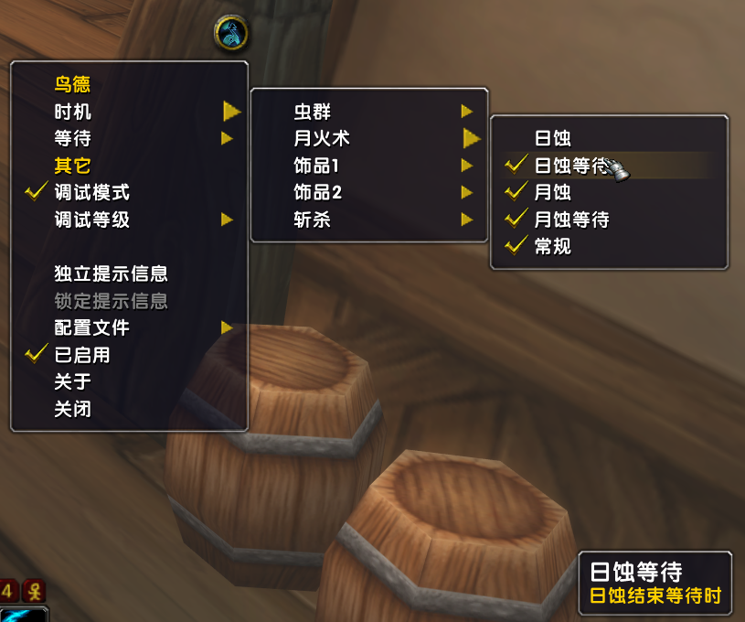
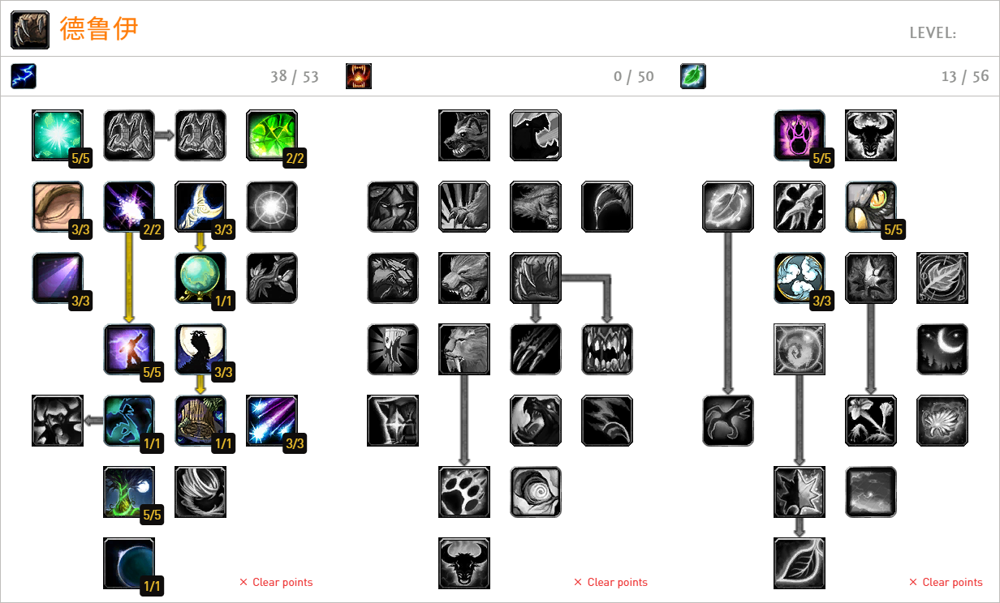

# 鸟德辅助插件

> __自娱自乐，不做任何保证！__  
> 如遇到BUG可反馈至 xhwsd@qq.com 邮箱


## 功能


- 可视化设置
- 无脑一键
- 使用饰品
- 等...


## 使用
- 安装`!Libs`插件
- [可选][[文档](https://github.com/pepopo978/Cursive/)][[下载](https://github.com/pepopo978/Cursive/archive/master.zip)]安装`Cursive`插件，安装后将区分减益是否是自己施放
    - [依赖][[文档](https://github.com/balakethelock/SuperWoW/)][[下载](https://github.com/balakethelock/SuperWoW/releases/download/Release/SuperWoW.release.1.5.1.zip)]安装`SuperWoW`模组
- [可选][[文档](https://github.com/xhwsd/SuperMacro/)][[下载](https://github.com/xhwsd/SuperMacro/archive/master.zip)]安装`SuperMacro`插件，安装后将获得更多宏位
- [[文档](https://github.com/xhwsd/DruidBird/)][[下载](https://github.com/xhwsd/DruidBird/archive/main.zip)]安装`DruidBird`插件
- 基于插件提供的函数，创建普通或超级宏
- 将宏图标拖至动作条，然后使用宏

> 确保插件最新版本、已适配乌龟服、目录名正确（如删除末尾`-main`、`-master`等）


## 可用宏

### 日食

> 根据自身增益输出法术

```lua
/script -- CastSpellByName("愤怒")
/script DruidBird:Eclipse()
```

大致逻辑：
- 斩杀阶段
    - 有万物平衡时
        - 打星火术
    - 打愤怒
- 日蚀阶段
    - 有日蚀时
        - 补DOT
        - 使用饰品
        - 打愤怒
    - 日蚀结束等待时
        - 补DOT
        - 打愤怒
        - 等待超时转常规阶段

- 月蚀阶段
    - 有月蚀时
        - 补DOT
        - 使用饰品
        - 打星火术
    - 月蚀结束等待时
        - 补DOT
        - 打星火术
        - 等待超时转常规阶段
- 常规阶段
    - 补DOT
    - 有万物平衡时
        - 打星火术
    - 打愤怒


> 以上为大致逻辑，可通过选项控制！


### 诅咒

```
/cursive multicurse 虫群|HIGHEST_HP|warnings,priotarget,minhp=1000
```

> 基于`Cursive`插件实现给附近战斗中怪补虫群，更多选项或命令请参考[文档](https://github.com/pepopo978/Cursive/blob/master/README.md)


## 参考

### 天赋
[](https://talents.turtle-wow.org/druid?points=oCaYYIFYBLFABAAAAAAAAAAAAAAAFAAoDAAAAAAAAAA=)


### 文档
- [1.17.2 咕咕PVE不完全指北](https://luntan.turtle-wow.org/viewtopic.php?t=1241) by Crazydru


## 鸣谢
- `jiang#1505`
- `Crazydru#4246`
